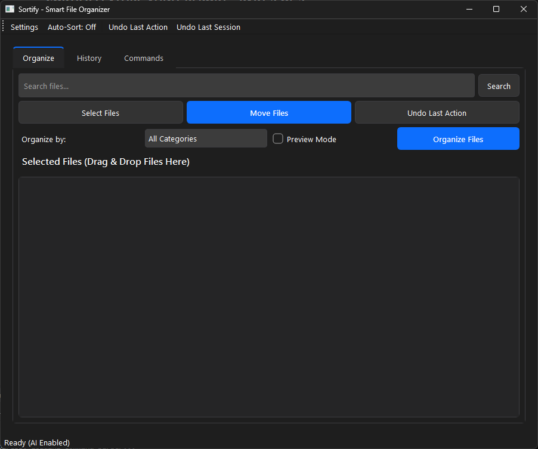

<div align="center">


# 🗂️ Sortify

**Your Files Are a Mess. We Get It. Let's Fix That.**

[](https://opensource.org/licenses/MIT)
[](https://www.python.org/downloads/)
[](https://github.com/Mrtracker-new/Sortify/issues)
[](https://github.com/Mrtracker-new/Sortify/stargazers)



[Get Started](#-get-started) • [Cool Features](#-what-can-it-do) • [How to Use](#-how-to-use-this-thing) • [Need Help?](#-troubleshooting)

</div>

---

## 🤔 What Is This?

Look, we've all been there. Your Downloads folder looks like a digital tornado hit it. Desktop covered in screenshots from 2019. "New Folder (47)" is mocking you.

Sortify is basically Marie Kondo for your computer (but less judgmental). It's a smart file organizer that:
- **Actually understands your files** - Not just "oh it ends in .jpg, must be an image" but "hey this is a WhatsApp photo from last Tuesday"
- **Uses AI** - Because it's 2025 and we should let robots do boring stuff
- **Works while you sleep** - Set it and forget it (like a Crockpot, but for files)

### 🎯 Why Should I Care?

- **Stop Wasting Time** - Seriously, how many hours have you spent looking for that one PDF?
- **Your Desktop Will Thank You** - No more "Screenshot_20231204_final_FINAL_v2.png"
- **It's Actually Smart** - Knows the difference between vacation photos and AI-generated memes
- **Plain English Commands** - Just tell it "move all PDFs older than 30 days" and boom, done
- **Works While You Netflix** - Automatically sorts new files as they arrive

## ✨ What Can It Do?

### 🔄 Auto-Sort (The Magic Button)
Literally watches your folders and sorts stuff automatically. Like having a really organized friend who never sleeps.
- Detects new files instantly (faster than you can say "where did I save that?")
- Works in the background (minimized, not minimized, whatever)
- Can watch multiple folders at once (overachiever mode)

### ↩️ Undo Button (Because We All Make Mistakes)
Oops, didn't mean to move that? No problem.
- "Oh crap" button for your last move
- Full history of everything it's ever touched
- Cherry-pick specific operations to undo (time travel, basically)

### 🖱️ Drag & Drop (Like Literally Just Drag It)
If you can drag an icon, you can use this feature. That's it. That's the tutorial.
- Works exactly like you think it does
- Multiple files? Sure, go wild
- Even grandma could figure this out

### ⏰ Schedule It (For the Planners)
Want it to auto-sort every Tuesday at 3 AM? Weird, but okay.
- Daily, weekly, monthly - pick your poison
- Set up multiple schedules (one for downloads, one for desktop, etc.)
- Runs even when you're not looking

### 🧠 AI-Powered Brain (The Cool Part)
This isn't your grandpa's file sorter. It actually *thinks* about your files.
- Reads file contents, not just extensions (detective mode activated)
- Gets smarter over time (unlike my goldfish)
- "Oh that's a resume!" "That's an invoice!" *actually understands things*

### 🖼️ Smart Image Sorting (It Knows What's In Your Photos)
Not all images are created equal, and this tool knows it.
- Can tell if there are faces in photos (not creepy, we promise)
- Screenshots? Sorted. Real photos? Sorted differently.
- Scanned documents get their own VIP section

### 📱 Social Media Sorter (Because You Download Everything)
Knows the difference between your Instagram save-for-laters and WhatsApp group chat chaos.
- WhatsApp, Telegram, Instagram, Facebook, YouTube - it knows them all
- Separate folders for each platform (finally!)
- No more "wait, where did I save that TikTok?"

### 💬 Talk to It Like a Human
Forget complicated coding. Just tell it what you want in regular human speak.
- "Move all PDFs older than 30 days to Archive" ← IT UNDERSTANDS THIS
- "Delete temporary files" ← THIS TOO
- "Organize downloads by file type" ← EVEN THIS

No Ph.D. required.

### 🔍 Find Duplicates (Stop Hoarding)
**✨ NEW!** Finally implemented!
- Finds duplicate files by content (not just name)
- Shows you how much space you're wasting
- Safe delete mode (won't murder your files accidentally)

---

## 🚀 Get Started

### 💻 Will It Run on My Potato?

Probably! Here's what you need:

- **OS**: Windows 10/11, macOS 10.14+, or Linux (if you use Linux, you already know)
- **Python**: 3.8 or newer (no, Python 2 won't work, let it go)
- **Disk Space**: ~150MB (less than a single photo from your phone)
- **RAM**: 4GB minimum, 8GB if you want the AI to not think in slow motion
- **Internet**: Needed once to download the AI brain

### 📥 Installation (Choose Your Adventure)

#### Option 1: Windows Installer (Click and Pray)

1. Grab the latest installer from [Releases](https://github.com/Mrtracker-new/Sortify/releases)
2. Double-click it (you know how installers work)
3. Click "Next" a bunch of times
4. Find it in your Start menu

> **Heads up**: Windows might freak out and say "uNkNoWn pUbLiShEr!1!" - it's fine, we're just small and broke, not malicious.

#### Option 2: From Source (For the Nerds)

1. Clone it:
   ```bash
   git clone https://github.com/Mrtracker-new/Sortify.git
   cd Sortify
   ```

2. Make a virtual environment (trust me on this):
   ```bash
   python -m venv venv
   
   # Linux/macOS people
   source venv/bin/activate
   
   # Windows people
   venv\Scripts\activate
   ```

3. Install all the things:
   ```bash
   pip install -r requirements.txt
   ```

4. Fire it up:
   ```bash
   python main.py
   ```

**Troubleshooting PyQt6 Issues:**
If you get a DLL error on Windows (yeah, Windows things):
```bash
pip uninstall PyQt6 PyQt6-Qt6 PyQt6-sip
pip install -r requirements.txt
```
Still broken? Install [Visual C++ Redistributables](https://aka.ms/vs/17/release/vc_redist.x64.exe) and try again.

#### Option 3: Build Your Own Installer (Advanced Wizardry)

Check the scripts in `build_tools/` if you want to compile your own installer. Not for the faint of heart.

### 📚 How to Use This Thing

Pick your organizing style:

<details>
<summary><b>🔄 Real-time Auto Sort</b></summary>
<br>

1. Click the "Auto-Sort" toggle in the toolbar
2. Select a folder to watch
3. Choose a destination for sorted files
4. Files added to the watched folder will be automatically sorted
</details>

<details>
<summary><b>🖱️ Drag & Drop</b></summary>
<br>

1. Simply drag files from your file explorer
2. Drop them into the main window
3. Use the organize button to sort them
</details>

<details>
<summary><b>⏰ Scheduled Sorting</b></summary>
<br>

1. Open Settings from the toolbar
2. Go to the "Scheduled Sorting" tab
3. Configure your schedule and select folders
4. Add the job to the scheduler
</details>

<details>
<summary><b>📱 Social Media Content Organization</b></summary>
<br>

1. No additional setup required - works automatically
2. Media files with names containing platform identifiers (e.g., "whatsapp", "telegram", "instagram") will be sorted into dedicated folders
3. Supports common video formats (mp4, avi, 3gp, mov) and image formats (jpg, jpeg, png)
</details>

<details>
<summary><b>💬 Natural Language Commands</b></summary>
<br>

1. Go to the "Commands" tab
2. Enter a command like "Move all PDFs to Archive folder"
3. Click "Execute Command"
4. You can also use the example commands provided

**Example Commands:**
- "Move all images to Pictures folder"
- "Sort PDFs older than 30 days into Archive folder"
- "Organize downloads by file type"
- "Move videos larger than 1GB to External Drive"
- "Find duplicate files in Documents folder"
</details>

## ❓ Help, It's Broken!

<details>
<summary><b>It Won't Even Open</b></summary>
<br>

1. Got Python 3.8 or newer? Check with `python --version`
2. Try: `pip install -r requirements.txt` (sometimes dependencies get lonely)
3. Look at the error message (I know, reading is hard, but try)
4. Right-click → "Run as Administrator" (when in doubt, ask for more permissions)
5. If you see a PyQt6 DLL error, see the installation section above
</details>

<details>
<summary><b>It's Not Sorting My Stuff</b></summary>
<br>

1. Do those folders actually exist? (serious question)
2. Can you write to that folder? Try creating a text file there manually
3. Is the file type supported? We're good, but not magic
4. Is another app using the file? Close Excel, for the love of... just close it
</details>

<details>
<summary><b>The AI Seems... Not Smart</b></summary>
<br>

1. First run? You need internet to download the brain
2. Check if model files are in the app folder
3. Turn it off and on again (classic IT solution)
4. Got at least 4GB of RAM? The AI needs food to think
</details>

<details>
<summary><b>Windows Is Having a Panic Attack</b></summary>
<br>

1. Windows Defender freaking out? Add Sortify to the exclusions list
2. Download from official GitHub only (duh)
3. We're not malware, Windows is just paranoid about unsigned software
</details>

## 🔧 Technical Details

<details>
<summary><b>Architecture</b></summary>
<br>

The application uses a modular architecture with these key components:

- **Core Modules**:
  - `watcher.py`: Implements real-time folder monitoring
  - `scheduler.py`: Manages scheduled sorting tasks
  - `ai_categorizer.py`: Provides machine learning-based file classification
  - `image_analyzer.py`: Analyzes image content and detects social media sources
  - `categorization.py`: Handles file categorization including social media detection
  - `file_operations.py`: Manages file sorting and organization with platform-specific rules
  - `command_parser.py`: Parses natural language commands

- **UI Components**:
  - `main_window.py`: Main interface with tabs
  - `settings_window.py`: Configuration interface for all features
</details>

<details>
<summary><b>Dependencies</b></summary>
<br>

### Key Libraries

- **watchdog**: Real-time file system monitoring
  - Detects file system events (creation, modification, deletion)
  - Provides event handlers for custom actions
  - Used in the watcher module for auto-sorting

- **apscheduler**: Advanced Python scheduler
  - Supports cron-like scheduling
  - Persists jobs between application restarts
  - Handles background task execution

- **scikit-learn**: Machine learning library
  - Powers the AI-based file categorization
  - Provides classification algorithms for file type prediction
  - Used for training custom categorization models

- **opencv-python**: Computer vision library
  - Analyzes image content for intelligent sorting
  - Detects faces, documents, and screenshots
  - Extracts visual features for categorization

- **nltk**: Natural Language Toolkit
  - Processes natural language commands
  - Performs text tokenization and parsing
  - Extracts meaning from user instructions

- **spaCy**: Advanced NLP library
  - Provides named entity recognition
  - Understands semantic relationships in commands
  - Enhances natural language command parsing

- **PyQt6**: GUI framework
  - Creates the modern user interface
  - Handles drag & drop functionality
  - Manages application windows and dialogs

### Full Dependencies

See [requirements.txt](requirements.txt) for a complete list of dependencies and version requirements.
</details>

## 👥 Want to Help?

Awesome! We love contributors:

### How You Can Help:

- 🐛 **Found a bug?** Tell us on [GitHub Issues](https://github.com/Mrtracker-new/Sortify/issues)
- 💡 **Got ideas?** Share them in [Discussions](https://github.com/Mrtracker-new/Sortify/discussions)
- 🧪 **Write tests** (we know, nobody likes writing tests, but please?)
- 📝 **Fix typos** (there are definitely typos)
- 🔧 **Code stuff** (pull requests welcome!)
- 🌐 **Translate** (not everyone speaks English... or emoji)

### Development Setup

1. Fork the repository on GitHub
2. Clone your fork locally
3. Set up the development environment as described in the Installation section
4. Create a new branch for your feature or bugfix
5. Make your changes and add appropriate tests
6. Run the test suite to ensure everything works
7. Submit a pull request with a clear description of the changes

### The Rules (Please Follow Them)

- Use PEP 8 (Google it if you don't know)
- Commit messages that actually explain what you did
- Docstrings are your friend (future you will thank you)
- Tests. TESTS. **TESTS!**
- Update docs when you change stuff

## 📄 License

MIT License - basically do whatever you want, just don't sue us. See [LICENSE](LICENSE) for the legal mumbo jumbo.

## 📬 Questions? Problems? Want to Chat?

<div align="center">

👤 **Made by**: Rolan Lobo (hi mom!)  
📧 **Email**: [rolanlobo901@gmail.com](mailto:rolanlobo901@gmail.com)  
🐞 **Report Bugs**: [GitHub Issues](https://github.com/Mrtracker-new/Sortify/issues)  
⭐ **Like it?**: Star the repo (it makes us feel good)

---

*P.S. - If this tool saved you from digital chaos, consider buying me a coffee... or just star the repo. Stars are free and I'm broke.*

*Made with ❤️, ☕, and a lot of "why won't this work?!" moments*

</div>
