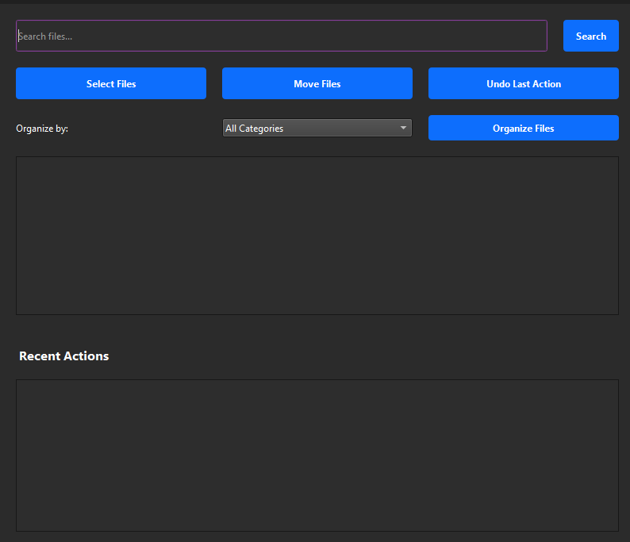

# Sortify 📂✨

 

**Your Smart File Organization Companion**  
*A PyQt6-powered desktop app that automates file sorting with military precision*

---

## 🚀 Features That Will Blow Your Mind

### 📦 Smart Organization
- **Auto-categorization** for 100+ file types
- **Custom folder hierarchies** with nested subcategories
- **Drag & Drop** support for effortless file management

### ⚡ Power Tools
- **Time Machine** (Undo last action)
- **Operation History** with timestamp tracking
- **Deep Search** across multiple directories
- **Cross-platform** performance

### 🎯 Precision Sorting
| Category      | Supported Formats                          | Icon |
|---------------|--------------------------------------------|------|
| **Documents** | PDF, DOCX, TXT, ODT, EPUB, CSV, XLSX       | 📄   |
| **Media**     | MP4, MKV, MOV, MP3, FLAC, WAV              | 🎵   |
| **Images**    | JPG, PNG, WEBP, RAW, SVG, PSD              | 📸   |
| **Code**      | PY, JS, JAVA, CPP, HTML, CSS               | 👨💻 |
| **Archives**  | ZIP, RAR, 7Z, TAR.GZ                       | 🗃️  |

---

## ⚙️ Installation Made Easy

### For Everyone
1. [Download Latest Release](https://github.com/Mrtracker-new/Sortify/releases)
2. Unzip package
3. Run executable:
   - **Windows**: `Sortify.exe`
   - **macOS**: `./Sortify.app`
   - **Linux**: `./Sortify`

### For Developers

# Clone repo
    git clone https://github.com/Mrtracker-new/Sortify.git
    cd Sortify

# Set up virtual environment
    python -m venv venv
    source venv/bin/activate  # Linux/macOS
    venv\Scripts\activate    # Windows

# Install dependencies
    pip install -r requirements.txt

# Launch application
    python main.py

# 🎮 Usage Guide

1.Basic Workflow
-Select Files
-Drag & Drop Demo
-Drag files or click "Add Files"

2.Choose Strategy
      
    # Sample organization rules
    RULES = {
    'Documents': ['.pdf', '.docx', '.txt'],
    'Code': ['.py', '.js', '.java'],
    # ... 100+ more rules
    }
3.Execute Organization
Organization Demo

# 🏗️ Folder Structure

    Organized_Folder/
    ├── Documents/
    │   ├── PDF/           # All PDF files
    │   ├── Word/          # DOC, DOCX, ODT
    │   └── Spreadsheets/  # XLSX, CSV, ODS
    ├── Media/
    │   ├── Music/         # MP3, FLAC, WAV
    │   └── Videos/        # MP4, MKV, MOV
    └── ... # 15+ categories

# 🛠️ Troubleshooting

Issue	Solution
File not recognized	Add extension to rules.yaml
Permission denied	Run as admin/root
Undo not working	Check history.log for errors

# 🤝 Contributing PRs Welcome
We ❤️ contributions! Here's how to help:

1.Fork the repository

2.Create your feature branch (git checkout -b feature/AmazingFeature)

3.Commit changes (git commit -m 'Add some magic')

4.Push to branch (git push origin feature/AmazingFeature)

5.Open a Pull Request

# 📜 License
MIT License - See LICENSE for details.
"With great sorting power comes great responsibility" - Sortify Manifesto

# 📬 Contact
Author: Rolan Lobo
Email![Uploading Emai<svg xmlns="http://www.w3.org/2000/svg" xmlns:xlink="http://www.w3.org/1999/xlink" width="192" height="20" role="img" aria-label="Email: rolanlobo901@gmail.com"><title>Email: rolanlobo901@gmail.com</title><linearGradient id="s" x2="0" y2="100%"><stop offset="0" stop-color="#bbb" stop-opacity=".1"/><stop offset="1" stop-opacity=".1"/></linearGradient><clipPath id="r"><rect width="192" height="20" rx="3" fill="#fff"/></clipPath><g clip-path="url(#r)"><rect width="41" height="20" fill="#555"/><rect x="41" width="151" height="20" fill="#e05d44"/><rect width="192" height="20" fill="url(#s)"/></g><g fill="#fff" text-anchor="middle" font-family="Verdana,Geneva,DejaVu Sans,sans-serif" text-rendering="geometricPrecision" font-size="110"><text aria-hidden="true" x="215" y="150" fill="#010101" fill-opacity=".3" transform="scale(.1)" textLength="310">Email</text><text x="215" y="140" transform="scale(.1)" fill="#fff" textLength="310">Email</text><text aria-hidden="true" x="1155" y="150" fill="#010101" fill-opacity=".3" transform="scale(.1)" textLength="1410">rolanlobo901@gmail.com</text><text x="1155" y="140" transform="scale(.1)" fill="#fff" textLength="1410">rolanlobo901@gmail.com</text></g></svg>l-rolanlobo901@gmail.com-red.svg…]()

Made with ❤️ and ☕ by Rolan who hate messy folders
