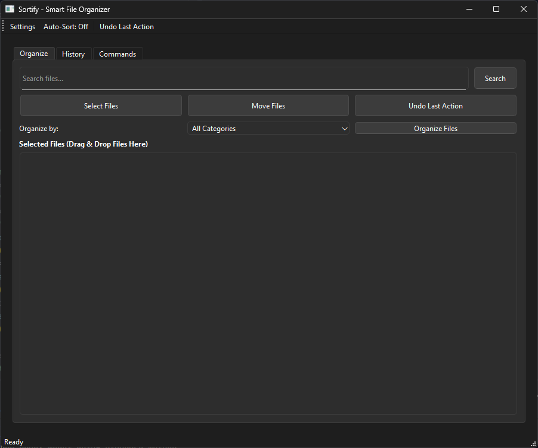

<div align="center">


# 🗂️ Sortify

**Your Digital Life is Chaos. Let's Sort It Out. Literally.**

[](https://opensource.org/licenses/MIT)
[](https://www.python.org/downloads/)
[](https://www.riverbankcomputing.com/software/pyqt/)



[What Is This?](#-what-even-is-this) • [Features](#-the-cool-stuff) • [Install](#-lets-get-started) • [Use It](#-how-to-actually-use-this-thing) • [Help](#-when-things-go-wrong)

</div>

---

## � What Even Is This?

Look, we've all been there. Your Downloads folder has 47 files named "IMG_1234.jpg", your Documents are full of "Untitled_final_FINAL_v3.docx", and you just spent 20 minutes looking for a bank statement from last week.

**Sortify is your AI-powered cleanup crew.** It's not just another file organizer—it actually *understands* what your files are about and sorts them intelligently. No more mindless "put all PDFs in one folder" nonsense.

### Why You'll Love It:
- 🧠 **Actually Smart**: Uses local AI to understand file *content*, not just extensions
- � **Totally Private**: Everything runs on YOUR computer. Zero cloud, zero data collection, zero tracking
- 🎯 **Scary Accurate**: Knows the difference between a recipe PDF and an invoice PDF
- � **Safety First**: Full undo history, dry-run previews, database backups—we're paranoid so you don't have to be
- 🤖 **Set & Forget**: Auto-watch folders and let it silently organize in the background

---

## 🎨 The Cool Stuff

### 🧠 AI-Powered Magic
**No Joke, It Actually Reads Your Files:**
- Uses **Sentence Transformers** (`all-MiniLM-L6-v2`) for semantic understanding
- Extracts text from PDFs via **PyPDF2** and Word docs via **python-docx**
- Detects AI-generated images (Midjourney, DALL-E, Stable Diffusion metadata)
- Understands context—won't confuse a cooking recipe with a tax receipt
- Analyzes image content using **OpenCV** for screenshots, memes, and document detection
- **100% offline**—your files never leave your machine

### 🎯 Smart Categorization
**It Knows Your Mess Better Than You Do:**
- Automatically detects social media exports (WhatsApp, Instagram, Telegram)
- Identifies file types by content (not just `.jpg` → Pictures!)
- Pattern recognition for invoices, receipts, screenshots, and downloads
- Natural language commands: "Move all images from last month to Archive"
- Customizable categories via config files

### 🛡️ Enterprise-Grade Safety (In a Free App, Wild Right?)
**We Really Don't Want You to Lose Your Stuff:**
- **Full Undo/Redo System**: SQLite-backed history with one-click rollback
- **Dry-Run Mode**: Preview every single change before committing
- **Database Integrity Checks**: Auto-repair with REINDEX/VACUUM on startup
- **Crash Recovery**: If something breaks, automatic restoration from backups
- **Duplicate Detection**: Finds conflicts and handles them gracefully
- **Path Validation**: Blocks dangerous operations (like moving `/` or deleting System32... yeah, we check)
- **Batch Operation Rollback**: If one file fails in a batch, *everything* rolls back atomically
- **Singleton Protection**: Prevents multiple instances to avoid database locks (Windows)

### 🤖 Automation Features
**Because Who Wants to Organize Manually?:**
- **Folder Watcher**: Real-time monitoring with **watchdog** library
- **Scheduler**: Set rules like "Sort Downloads every day at 2 AM"
- **CLI Mode**: Scriptable for cron jobs, batch processing, or automation workflows
- **Natural Language Parser**: Powered by **spaCy** for human-friendly commands
- **Auto-conflict Resolution**: Handles duplicate filenames intelligently

### 💎 Quality-of-Life Stuff
**The Little Things That Matter:**
- Beautiful **PyQt6 GUI** with drag-and-drop support
- Live progress indicators and detailed operation logs
- History browser with search and filtering
- Configuration manager for custom rules and categories
- JSON-based settings for easy sharing/backup
- Command-line fallback for everything (GUI optional)

---

## 🚀 Let's Get Started

### What You'll Need
- **Python 3.8+** (grab it from [python.org](https://www.python.org/downloads/))
- **4GB RAM minimum** (8GB if you want the AI to run smoothly)
- **~500MB free space** (mostly for AI models)
- **Windows/macOS/Linux** (we don't discriminate)

### Option 1: I Just Want It to Work (Windows Installer)
1. Head to [Releases](https://github.com/Mrtracker-new/Sortify/releases)
2. Download the `.exe` installer
3. Run it (Windows Defender *will* freak out because we're not paying for a code-signing certificate 💸)
4. Click "More Info" → "Run Anyway"
5. Done! Launch from Start Menu

### Option 2: I'm a Developer (From Source)
```bash
# Clone the repo
git clone https://github.com/Mrtracker-new/Sortify.git
cd Sortify

# Create virtual environment
python -m venv venv

# Activate it
# On Windows:
venv\Scripts\activate
# On macOS/Linux:
source venv/bin/activate

# Install dependencies
pip install -r requirements.txt

# Launch!
python main.py
```

**First Launch:** The AI model (~80MB) will auto-download. Grab a coffee ☕

---

## 💡 How to Actually Use This Thing

### �️ GUI Mode (The Easy Way)
1. **Launch the app** (double-click `main.py` or use the installer)
2. **Drag & drop** files/folders into the window, or click "Browse"
3. Click **"Organize Files"** to see what it'll do (dry-run preview)
4. Review the suggested categories
5. Hit **"Execute"** to make it happen
6. **Undo** anytime from the History tab

#### Auto-Watch Mode (Set It & Forget It):
1. Click the **"Auto-Sort"** toggle in the toolbar
2. Pick a folder to monitor (e.g., `C:\Users\You\Downloads`)
3. Sortify will now silently organize new files in real-time
4. Check the logs anytime to see what it's done

### ⌨️ CLI Mode (For Power Users & Automation)

#### Preview Mode (Safe):
```bash
python main.py --dry-run --source "C:\Users\You\Downloads" --organize
```
This shows a table of **what would happen** without moving anything.

#### YOLO Mode (Just Do It):
```bash
python main.py --yes --source "C:\Users\You\Downloads" --organize
```
Auto-confirms everything. Great for cron jobs.

#### Custom Destination:
```bash
python main.py --yes --source "~/Downloads" --dest "~/Documents" --folder "My Sorted Files"
```

#### Natural Language (Experimental):
```bash
python main.py --command "Move all PDFs older than 30 days to Archive"
```

---

## 🎯 Real-World Use Cases

### For Students:
- Auto-sort lecture slides, assignments, and research papers
- Separate textbook PDFs from notes
- Organize screenshots from online classes

### For Photographers:
- Detect and categorize RAW vs. JPEG
- Separate client photos by metadata
- Find AI-generated images mixed in your portfolio

### For Remote Workers:
- Sort invoices, contracts, and receipts automatically
- Archive old project files
- Organize meeting screenshots and recordings

### For Digital Hoarders:
- Clean up 10 years of Downloads in minutes
- Find duplicates across folders
- Recover space without losing anything (thanks to full undo)

---

## 🐛 When Things Go Wrong

### "The AI model is downloading forever!"
- First launch needs to grab ~80MB. Be patient!
- If stuck, delete `~/.cache/huggingface` and try again
- No internet? You'll need it once—models cache locally afterward

### "I can't move files / Permission denied"
- On Windows: Run as Administrator (right-click → "Run as administrator")
- On Linux/Mac: Check folder permissions with `ls -la`
- Sortify logs everything to `~/.sortify/debug.log`—check there for details

### "Database is locked" Error
- Only one instance of Sortify can run at a time (by design, to prevent corruption)
- Close any other Sortify windows and try again
- If it persists, restart your computer (honestly, it works)

### "Some PDFs/Word docs aren't being read"
- Make sure you have the required Python packages installed:
  - **PyPDF2** for PDF extraction: `pip install PyPDF2`
  - **python-docx** for Word docs: `pip install python-docx`
- These should already be in `requirements.txt`, but reinstall if needed
- Check `~/.sortify/debug.log` for specific extraction errors
- Some encrypted or password-protected PDFs may fail—this is expected

### "Windows Defender keeps blocking it!"
- We're an unsigned exe because code-signing certs cost $$$
- Add an exclusion: Windows Security → Virus & Threat Protection → Exclusions → Add Folder → Select Sortify folder
- Or build from source (Option 2 above)

### "It moved something I didn't want moved!"
- Click the **History** tab in the GUI
- Find the operation
- Click **Undo**
- If the GUI is closed, database backups are in `~/.sortify/data/`

### "I found a bug!"
- Amazing! [Open an issue](https://github.com/Mrtracker-new/Sortify/issues)
- Include:
  - What you did
  - What you expected
  - What actually happened
  - Your `debug.log` file (sanitize sensitive paths)

---

## 🤝 Want to Contribute?

Hell yeah! We'd love your help. Here's how:

- 🐛 **Report Bugs**: [Open an issue](https://github.com/Mrtracker-new/Sortify/issues)
- 💡 **Suggest Features**: Same place, just tell us your idea
- 🔧 **Submit PRs**: Fork, code, test, submit. Check `CONTRIBUTING.md` for guidelines
- ⭐ **Star the Repo**: Seriously, it makes our day. GitHub stars = dopamine

---

## 📖 How It Works (For Nerds)

**Tech Stack:**
- **GUI**: PyQt6 (beautiful, native, cross-platform)
- **AI**: Sentence Transformers (local semantic embeddings)
- **NLP**: spaCy (command parsing)
- **Image Analysis**: OpenCV + Pillow
- **File Watching**: watchdog library
- **Database**: SQLite (with paranoid integrity checks)
- **Concurrency**: APScheduler for background tasks

**Architecture Highlights:**
- Modular design: `core/` for logic, `ui/` for interface
- Safety-first: Every operation is logged, reversible, and validated
- Extensible: Add custom categories via JSON configs
- Well-tested: Check `tests/` for unit/integration tests

---

## 📄 License

**MIT License** — do whatever you want with this. Seriously.

- ✅ Use it commercially
- ✅ Modify the code
- ✅ Redistribute it
- ❌ Blame us if you lose your homework (but you won't, because: undo)

See [LICENSE](LICENSE) for legalese.

---

<div align="center">

### �‍💻 Made With Love By

**Rolan Lobo**  
📧 [rolanlobo901@gmail.com](mailto:rolanlobo901@gmail.com)  
🔗 [GitHub](https://github.com/Mrtracker-new)

---

*Built with ❤️, ☕, way too much local AI, and an unhealthy obsession with organized folders.*

**If this saved you even 5 minutes of your life, smash that ⭐ button!**

</div>
